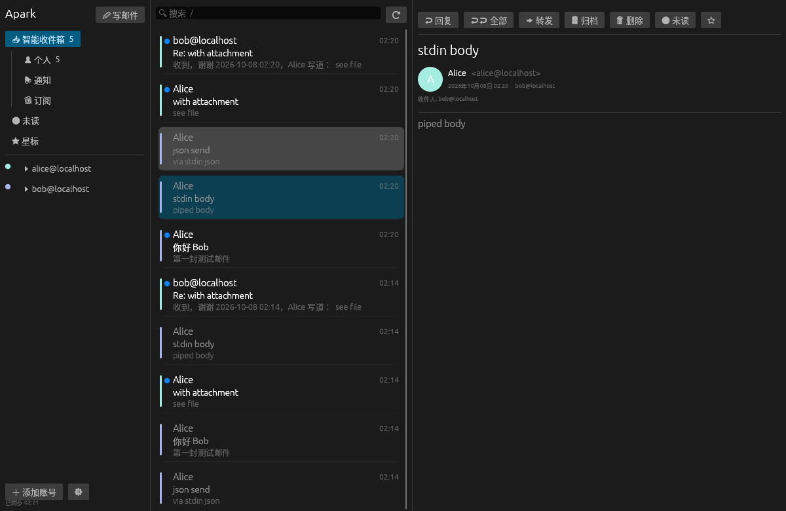

# Apark

一个快速、简洁的多账号邮件客户端，思路来自 Spark：**用一个 Google 总账号登录，其他邮箱自动回来**。

- **桌面版**：macOS（Apple Silicon / Intel）、Windows（x64 / ARM64）、Linux（x64 / ARM64）。原生编译的 Rust 程序，GPU 渲染（egui），不是 Electron。邮件列表虚拟化，只绘制可见行，几万封邮件也能顺滑滚动。
- **CLI / 无头版**：`apark` 单文件，所有功能都能用命令完成，`--json` 输出稳定，适合 AI agent 和服务器。桌面版的可执行文件同样接受全部 CLI 命令。
- **账号同步**：账号列表保存在总账号自己的 Google Drive 隐藏应用目录（`drive.appdata`），没有第三方服务器；可选同步密码，加密后再上传。



## 功能

| | 桌面版 | CLI |
|---|---|---|
| Google 总账号登录、恢复全部账号 | ✓ | `apark login` |
| Gmail / Google Workspace（OAuth） | ✓ | `apark add google` |
| Outlook / Microsoft 365（OAuth） | ✓ | `apark add microsoft` |
| 任意 IMAP/SMTP 邮箱（QQ、163、iCloud、Fastmail、自建…） | ✓ | `apark add imap` |
| 统一收件箱 + 智能分类（个人 / 通知 / 订阅） | ✓ | `apark list -c people` |
| 本地全文搜索（离线、即时） | ✓ | `apark search` |
| 阅读、回复、全部回复、转发（带原附件） | ✓ | `read` `reply` `forward` |
| 归档、删除、移动、星标、已读/未读 | ✓ | `archive` `trash` `move` `mark` |
| 附件下载 / 发送附件（桌面版拖入即添加） | ✓ | `attachments` `--attach` |
| 文件夹管理 | 浏览 | `folder create/rename/delete` |
| 后台定时同步 | ✓ | `apark daemon` |

键盘快捷键：`J/K` 上下、`E` 归档、`Delete` 删除、`R` 回复、`A` 全部回复、`F` 转发、`U` 未读、`S` 星标、`C` 写邮件、`/` 搜索、`⌘/Ctrl+Enter` 发送。

## 下载

在 [Releases](../../releases) 下载对应平台的包：

| 文件 | 内容 |
|---|---|
| `Apark-macos-arm64.zip` / `Apark-macos-x64.zip` | `Apark.app`（内含 `apark` CLI） |
| `Apark-windows-x64.zip` / `Apark-windows-arm64.zip` | `Apark.exe` + `apark.exe` |
| `Apark-linux-x64.tar.gz` / `Apark-linux-arm64.tar.gz` | `apark-desktop` + `apark` + `.desktop` 文件 |
| `apark-cli-*` | 只有 CLI（无头服务器用） |
| `apark-cli-linux-x64-static.tar.gz` | 静态链接 CLI，任何 Linux 都能跑 |

macOS 包没有经过 Apple 公证，第一次打开如提示“已损坏”，执行：

```sh
xattr -dr com.apple.quarantine /Applications/Apark.app
```

macOS 上让 CLI 可直接调用：`ln -s /Applications/Apark.app/Contents/MacOS/apark /usr/local/bin/apark`。

## 第一次使用：准备 Google OAuth 客户端

Google 不允许第三方客户端共用别人的 OAuth 凭据访问邮箱，所以需要用你自己的 Google Cloud 项目创建一个（一次性，5 分钟）：

1. 打开 [Google Cloud Console](https://console.cloud.google.com/)，新建项目。
2. **API 和服务 → 库**：启用 **Google Drive API**（账号同步用；IMAP 不需要额外启用 API）。
3. **OAuth 同意屏幕**：用户类型选“外部”，填应用名 Apark；
   作用域添加 `https://mail.google.com/` 和 `.../auth/drive.appdata`；
   **发布状态改为“正式版（In production）”**——“测试”状态下的授权 7 天就会过期。
   未经 Google 审核的应用登录时会提示“Google 尚未验证此应用”，点“高级 → 继续”即可（自用不影响）。
4. **凭据 → 创建凭据 → OAuth 客户端 ID**，应用类型选 **桌面应用**，得到客户端 ID 和客户端密钥。
5. 填进 Apark：桌面版点 **设置**；或命令行：

   ```sh
   apark config set google_client_id     xxxx.apps.googleusercontent.com
   apark config set google_client_secret GOCSPX-xxxx
   ```

   也可以用环境变量 `APARK_GOOGLE_CLIENT_ID` / `APARK_GOOGLE_CLIENT_SECRET`，或在仓库 Secrets 里配置后由 CI 编进发布包。

然后：

```sh
apark login            # 浏览器里选择总账号并授权
apark add google       # 再加其他 Gmail
apark add imap --email me@qq.com     # QQ/163/iCloud 等用“授权码/应用专用密码”
apark sync && apark list
```

在另一台电脑上只需 `apark login`（或桌面版点“使用 Google 账号登录”），其余账号自动恢复。

**Microsoft 账号（可选）**：在 [Azure 门户](https://portal.azure.com/) → 应用注册 → 新注册，账户类型选“任何组织目录中的帐户和个人 Microsoft 帐户”，平台选“移动和桌面应用程序”，重定向 URI 填 `http://127.0.0.1`，然后 `apark config set microsoft_client_id <应用程序ID>`。

**无浏览器的服务器**：`apark login --manual`，在任意设备打开输出的链接，授权后浏览器会跳到一个打不开的 `http://127.0.0.1:…` 地址，把这个完整地址粘贴回终端即可。

## CLI（给人和 AI agent）

```sh
apark guide                      # 给 agent 的完整命令说明
apark list --unread --json       # 所有账号未读邮件
apark search 发票 2026 --json
apark read 42 --json             # {"message": {...}, "body": {"text","html","attachments"}}
apark reply 42 --body "收到，周五前处理"
apark send --from me@gmail.com --to a@b.com -s "周报" --body-file report.md --attach report.pdf
echo '{"from":"me@gmail.com","to":["a@b.com"],"subject":"hi","body":"..."}' | apark send --stdin-json
apark archive 42 43 44
apark daemon --interval 120      # 无头常驻同步
```

所有命令：成功退出码 0；失败退出码 1，`--json` 模式下输出 `{"ok": false, "error": "..."}`。读取类命令只查本地缓存，毫秒级返回；`apark sync` 或常驻的 `apark daemon` 负责刷新。

systemd 无头部署示例：

```ini
[Unit]
Description=Apark mail sync
After=network-online.target

[Service]
ExecStart=/usr/local/bin/apark daemon
Environment=APARK_HOME=/var/lib/apark
Restart=always

[Install]
WantedBy=multi-user.target
```

## 数据与安全

- 数据目录：macOS `~/Library/Application Support/Apark`，Windows `%APPDATA%\Apark`，Linux `~/.local/share/Apark`；可用 `APARK_HOME` 覆盖。
- `accounts.json`（凭据）权限为 0600；邮件缓存在 `apark.db`（SQLite）。
- 云端账号列表只存在总账号的 Drive 隐藏目录，只有你的 OAuth 客户端能读取；设置 `sync_passphrase` 后会用 Argon2 + ChaCha20-Poly1305 加密，各设备需填写相同密码。
- 自建邮件服务器使用私有 CA 时，可设置 `APARK_EXTRA_CA=/path/ca.pem`。

## 为什么快

- 界面只读本地 SQLite（WAL，读写分离连接），从不在 UI 线程等网络。
- 同步先拉邮件头（列表立刻出现），再在后台预取较小的正文，打开邮件即时显示。
- 已读、星标、归档、删除先在本地生效，再异步同步到服务器。
- 列表只绘制可见行；无动画、无 Web 引擎，常驻内存很小。

HTML 邮件在应用内显示为纯文本版本，需要原始排版时点“🌐 浏览器打开”。

## 构建

```sh
cargo test --workspace
cargo build --release -p apark-cli        # 只要 CLI：target/release/apark
cargo build --release -p apark-desktop    # 桌面版：target/release/apark-desktop
```

打 `v*` 标签后，GitHub Actions 会为全部平台和架构构建并发布 Release。

## 结构

```
crates/core      账号、OAuth、IMAP 同步、SMTP、SQLite 缓存、云端账号同步
crates/cli       apark 命令（lib + bin，桌面版复用）
crates/desktop   egui 桌面界面
packaging/       各平台打包脚本
```

## License

MIT
